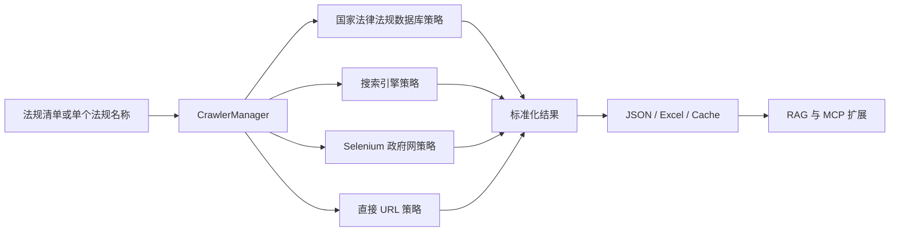

# Law Crawler RPA RAG MCP

面向中文法律法规研究、合规分析和知识库建设的开源采集工具。项目聚焦“权威来源优先、结构化输出、可追溯证据链”，支持从国家法律法规数据库、中国政府网及政府站点搜索结果中采集法规元数据和正文，并导出 JSON 与 Excel 台账，为后续 RAG、MCP 服务和法律智能体提供干净的数据底座。

> 本项目用于公开法律法规资料的学习、研究和合规技术实验，不提供法律意见。请遵守目标网站的 robots.txt、服务条款和当地法律法规。

## 为什么值得关注

- 权威来源优先：优先检索国家法律法规数据库，搜索引擎和政府站点作为补充。
- 多策略采集：国家库 API、HTTP 搜索、Selenium 政府网页、直接 URL 访问分层兜底。
- 结构化台账：自动导出法规名称、文号、发布日期、实施日期、机关、层级、状态、来源链接和采集时间。
- 可追溯数据：同时保存简化 JSON、详细 JSON 和 Excel，方便审计与复核。
- 面向 RAG/MCP 演进：仓库已预留 `src/rag`、`src/mcp` 模块，目标是从采集工具演进为法律知识服务基础设施。

## 当前能力

| 模块 | 状态 | 说明 |
| --- | --- | --- |
| 法规采集 | 可用 | 支持单法规和批量采集 |
| 多策略调度 | 可用 | `CrawlerManager` 根据策略编号或默认链路执行 |
| 元数据提取 | 可用 | 提取发布日期、文号、机关、层级、时效等字段 |
| Excel 台账 | 可用 | 生成带来源超链接的审计台账 |
| 缓存管理 | 可用 | 按法规类型分类保存采集结果 |
| RAG | 规划中 | 待接入向量索引和混合检索 |
| MCP 服务 | 规划中 | 待封装为可被智能体调用的工具服务 |

## 快速开始

### 1. 准备环境

```bash
python -m venv .venv
source .venv/bin/activate
pip install -r requirements.txt
```

如需运行测试和开发工具：

```bash
pip install -r requirements-dev.txt
```

### 2. 配置运行参数

```bash
cp .env.example .env
```

默认配置位于 [config/dev.toml](config/dev.toml)。常用环境变量示例：

```bash
CRAWLER__CRAWL_LIMIT=10
CRAWLER__MAX_CONCURRENT=3
LOG__LEVEL=INFO
PROXY_POOL__ENABLED=false
```

### 3. 单法规采集

```bash
python main.py --law "中华人民共和国民法典" --verbose
```

指定策略：

```bash
python main.py --law "中华人民共和国民法典" --strategy 1
```

策略编号：

| 编号 | 策略 |
| --- | --- |
| 1 | 国家法律法规数据库 |
| 2 | HTTP 搜索引擎 |
| 3 | Selenium 搜索引擎 |
| 4 | Selenium 政府网 |
| 5 | 直接 URL 访问 |

### 4. 批量采集

批量模式会读取 `Background info/law list.xls`。该文件包含业务侧法规清单，默认不纳入 Git 管理。

```bash
python main.py --limit 10
```

输出文件：

```text
data/raw/json/              # 简化 JSON
data/raw/detailed/          # 详细 JSON
data/ledgers/               # Excel 台账
data/cache/                 # 分类缓存
```

## 架构



核心目录：

```text
src/crawler/                # 爬虫调度、基础类和策略实现
src/storage/                # 数据库模型与存储
src/report/                 # Excel 台账生成
src/utils/                  # 可测试的通用工具
src/rag/                    # RAG 预留模块
src/mcp/                    # MCP 预留模块
config/                     # TOML 和日志配置
docs/                       # 架构、路线图和阶段文档
tests/unit/                 # 单元测试
```

## 开发与测试

```bash
make check
```

等价命令：

```bash
python -m unittest discover tests/unit
python -m compileall main.py src tests/unit
```

项目已加入 GitHub Actions，Pull Request 会执行依赖安装、单元测试和基础编译检查。

## 示例输出

仓库提供一个不依赖真实爬取的示例结果：[examples/sample_crawl_result.json](examples/sample_crawl_result.json)。

简化后的台账行形如：

```json
{
  "目标法规": "中华人民共和国民法典",
  "法规名称": "中华人民共和国民法典",
  "文号": "中华人民共和国主席令第四十五号",
  "发布日期": "2020-05-28",
  "实施日期": "2021-01-01",
  "来源渠道": "国家法律法规数据库",
  "采集状态": "成功"
}
```

## 数据源与合规原则

当前支持：

- 国家法律法规数据库：https://flk.npc.gov.cn
- 中国政府网：https://www.gov.cn
- 搜索引擎定位到的政府站点页面

采集原则：

- 优先访问权威公开来源。
- 控制并发和请求频率。
- 保留来源链接和采集时间，方便人工复核。
- 不绕过登录、付费、访问控制或非公开数据边界。

## 路线图

- 数据采集：更多国家级和地方政府公开数据源、PDF 解析、增量更新。
- 数据治理：法规版本关系、修订历史、失效状态、引用关系。
- 检索增强：分层切片、向量索引、BM25 与向量混合检索。
- RAG 应用：可溯源问答、条款级引用、答案置信度。
- MCP 服务：将采集、检索、台账导出封装为智能体可调用工具。
- 产品体验：Web 控制台、采集任务队列、结果复核工作台。

## 适合贡献的方向

- 新数据源策略：地方人大、地方政府、国务院公报等公开站点。
- 解析器：PDF、HTML 正文、法规条款结构化。
- 测试样本：最小化、可公开复现的法规页面样本。
- RAG 管道：切片、索引、召回评估和引用校验。
- 文档：真实使用案例、部署指南、合规边界说明。

贡献前请阅读 [CONTRIBUTING.md](CONTRIBUTING.md)。安全问题请参考 [SECURITY.md](SECURITY.md)。

## 许可证

本项目采用 MIT License，详见 [LICENSE](LICENSE)。
