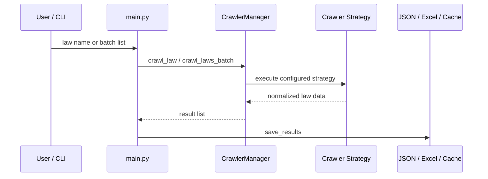

# Architecture

Law Crawler RPA RAG MCP 的核心目标是把公开法律法规资料转化为可审计、可检索、可复用的结构化数据。系统按“采集策略、调度聚合、标准化输出、后续知识服务”分层。

## Runtime Flow

## Key Components

### CLI Layer

[main.py](../main.py) 负责参数解析、批量清单读取、结果保存和最终统计。通用日期标准化逻辑已下沉到 [src/utils/date_utils.py](../src/utils/date_utils.py)，便于独立测试。

### Crawler Manager

[src/crawler/crawler_manager.py](../src/crawler/crawler_manager.py) 是策略编排入口，负责：

- 延迟初始化各类爬虫。
- 根据策略编号执行单一策略。
- 在默认模式中按多层策略尝试。
- 写入分类缓存。
- 控制并发。

### Strategy Layer

[src/crawler/strategies](../src/crawler/strategies) 包含实际采集策略：

- `search_based_crawler.py`：国家法律法规数据库。
- `search_engine_crawler.py`：搜索引擎定位政府站点。
- `optimized_selenium_crawler.py`：复杂页面和浏览器场景。
- `direct_url_crawler.py`：直接 URL 访问兜底。
- `law_matcher.py`：法律名称匹配与评分。

### Output Layer

当前输出包括：

- 简化 JSON：与 Excel 字段接近，方便业务消费。
- 详细 JSON：保留更多原始响应和扩展字段，方便调试。
- Excel 台账：适合法规清单复核和交付。
- 分类缓存：按法律、行政法规、部门规章等目录保存。

[src/report/crawl_result_exporter.py](../src/report/crawl_result_exporter.py) 负责采集结果的字段标准化、来源渠道归一、JSON 导出和 Excel 导出。[main.py](../main.py) 只保留 CLI 流程和用户可见输出。

## Design Principles

- Authority first：权威来源优先于搜索结果。
- Traceability：保留来源链接、采集时间和原始字段。
- Conservative crawling：默认控制频率和并发。
- Testable utilities：把纯逻辑移出 CLI 和爬虫副作用代码。
- Extensible services：RAG 和 MCP 作为后续服务层，而不是塞进爬虫策略。

## Extension Points

新增数据源时建议：

1. 继承或对齐 `BaseCrawler` 接口。
2. 实现搜索、详情获取和下载能力。
3. 在 `CrawlerManager` 中延迟初始化并接入策略选择。
4. 增加最小单元测试或可离线复现的解析样例。
5. 在 README 和本文件中说明数据源边界。
